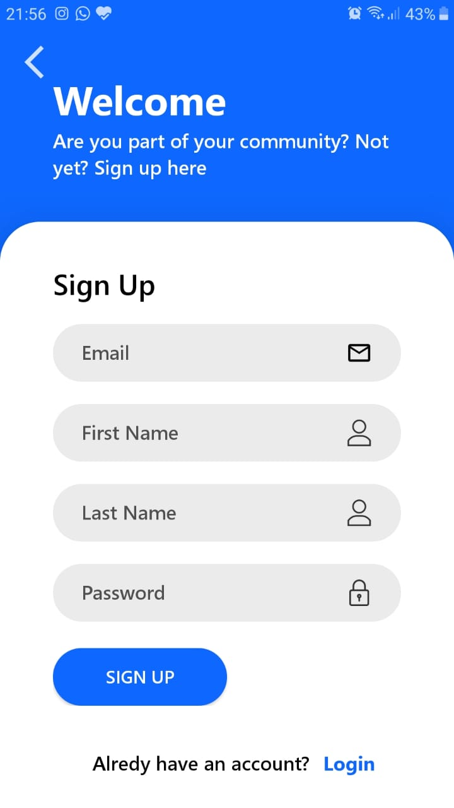
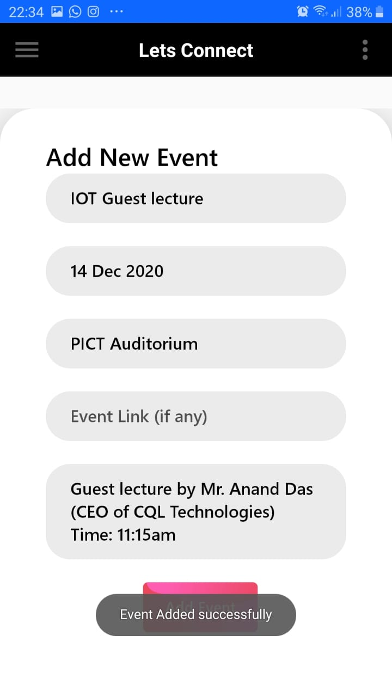

# LetsConnect

LetsConnect is an Android Application for students and working professionals 
which aims to provide a platform for finding and building local communities 
having similar interests in technology. With this app, people can join different 
groups based on their interests, see the contents posted by other users and can 
also post new content. People can view different seminars, workshops, hands on 
sessions (past and upcoming) and can attend them if they wish to. The Admin of 
the app will be responsible for adding new domains, authenticating the users, 
managing the database, verify the contents posted by users of the app and create 
new events. The app users can post content in image format.

## A Few Screenshots:

### 1. Login Page

### 2. Signup Page

### 3. Domains Page

### 4. Admin Dashboard

### 5. Events Page

### 6. Events Details

### 7. Event Details

### 8. Add Event

